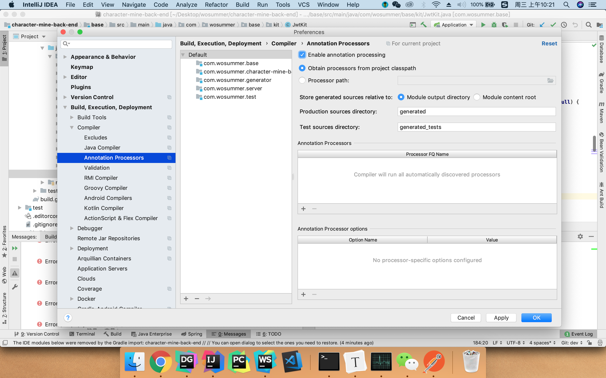

# 5.29

##### Idea lombok java 编译找不到符号的bug




##### Mac输入法切换

```
control + space
```

##### Idea快速返回上次查看代码的位置

```
back:
command + [ or option + command + <-

forward:
command + ] or option + command + ->
```

##### Mac下的 Home  和 end

```
fn + <- && fn + ->
```

##### Idea消除无用import

```
control + alt + O
```

代码格式化

```
option + command + L
```

find in path （全局搜索）

```
shift + command + L
```

