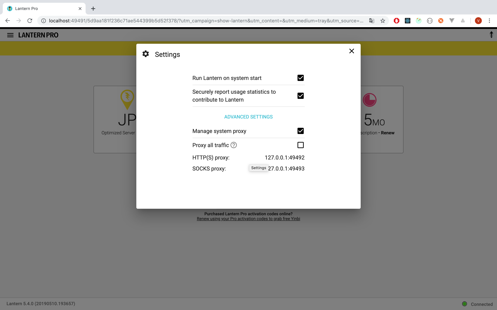

# 5.30

##### 在本地**终端**命令行下访问外网

打开自己蓝灯页面设置 中的一项: HTTP(S)代理服务器：127.0.0.1：端口号,查看自己的端口号，假设是 ：49492,打开蓝灯，**终端**下输入：

```
export http_proxy=http://127.0.0.1:49492

export https_proxy=http://127.0.0.1:49492
```



##### Mac快捷键

删除文件

```
command + delete
```

清空垃圾桶

```
command + delete + shift
```

显示桌面

```
command + F3
```

安装ELK

```shell
docker pull docker.elastic.co/elasticsearch/elasticsearch-oss:6.1.1

docker pull docker.elastic.co/logstash/logstash-oss:6.1.1

docker pull docker.elastic.co/kibana/kibana-oss:6.1.1
```

名字太长使用tag

```
docker tag docker.elastic.co/elasticsearch/elasticsearch-oss:6.1.1 elasticsearch:6.1.1

docker tag docker.elastic.co/logstash/logstash-oss:6.1.1 logstash:6.1.1

docker tag docker.elastic.co/kibana/kibana-oss:6.1.1 kibana:6.1.1
```

运行elk

```
docker run -p 9200:9200 -p 9300:9300 --name elasticsearch -e "discovery.type=single-node" elasticsearch:6.1.1

docker run -d -p 5601:5601 --link elasticsearch -e ELASTICSEARCH_URL=http://elasticsearch:9200 kibana:6.1.1

```

