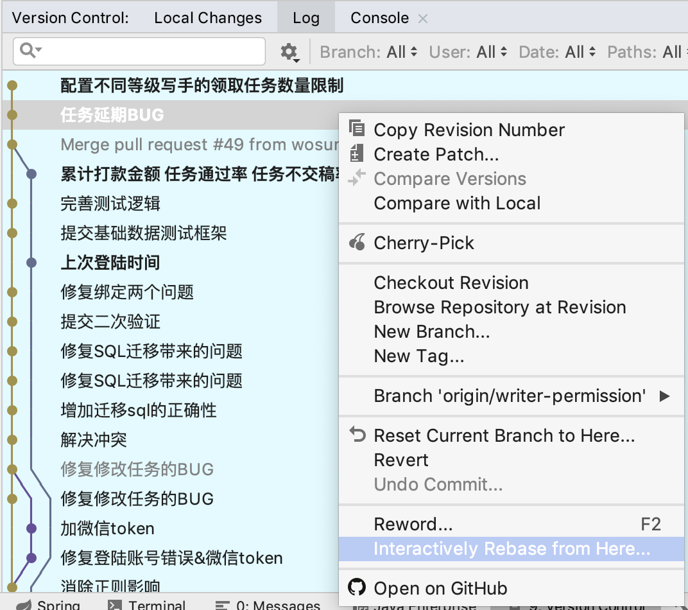
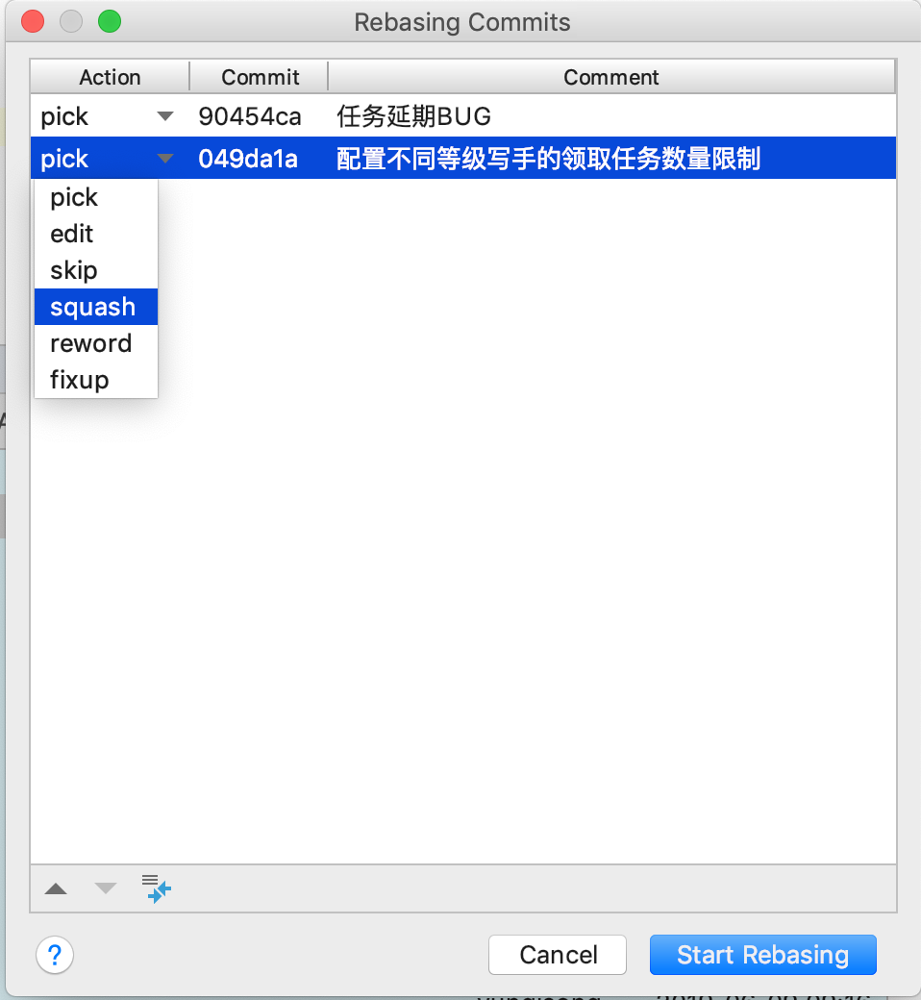

# 6.11


使用Idea合并多个commit





 如何搭建docker 镜像仓库

docker registrey 

## Basic commands

Start your registry

```
docker run -d -p 5000:5000 --name registry registry:2
```

Pull (or build) some image from the hub

```
docker pull ubuntu
```

Tag the image so that it points to your registry

```
docker image tag ubuntu localhost:5000/myfirstimage
```

Push it

```
docker push localhost:5000/myfirstimage
```

Pull it back

```
docker pull localhost:5000/myfirstimage
```

Now stop your registry and remove all data

```
docker container stop registry && docker container rm -v registry
```

无法解决单点问题，无界面，所以大家不用这个

搭建Harbor