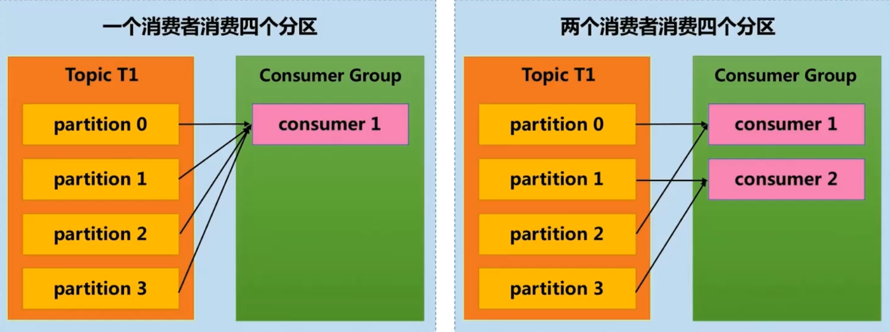
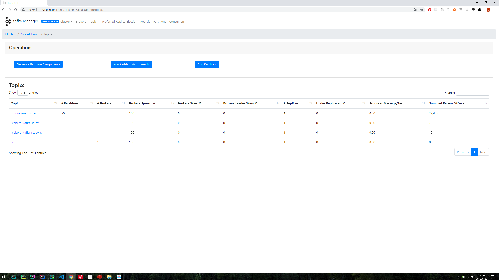
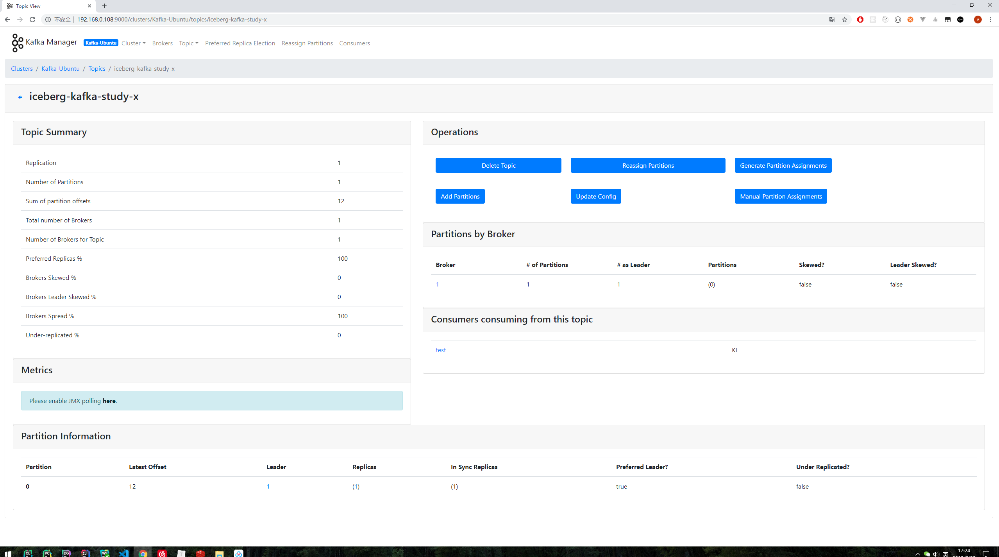

# 6.15

Ubuntu安装Docker

```
sudo apt install -y docker.io
```

如何在ubuntu 中彻底删除docker

配置docker加速器

# 使用dpkg查询已安装包，针对性删除

```
# 查询相关软件包
dpkg -l | grep docker
# 删除这个包
sudo apt remove --purge docker.io
```

删除前后的控制台输出如下：

git 添加远程仓库

```
git remote -v git@github.com:VaderWang/ts-axios.git
```

# kafka安装

消息系统分为2类，一种是点对点的消息系统一种是发布订阅的消息系统


点对点的消息系统使用一个队列存储消息，当消息消费后从队列中删除，在这种模式下，即使多个消费者同时消费，消费的顺序也是一致的。

发布订阅系统将消息持久化到一个Topic中，消费者可以订阅多个Topic，同一条数据可以被多个消费者消费，消息不会被删除。

kafka是一个分布式的消息订阅系统，有着消费着组的概念（一个消费者组可以消费全部消息），多出partition数量的consumer不会被分配消息。所以consumer的数量不会多于partition。




https://kafka.apache.org/downloads

```shell
tar -zxvf kafka_2.12-2.1.0.tgz
```

```
kafka_2.12-2.1.0/config/server.properties
broker.id=1
log.dir=/kafka/logs
```

启动 ZK Kafka 安装包自带 ZK，可以单节点启动

```shell
bin/zookeeper-server-start.sh -daemon config/zookeeper.properties
```

启动 Kafka 服务器

```
bin/kafka-server-start.sh config/server.properties
```

创建 Topic（test）

```
bin/kafka-topics.sh --create --zookeeper localhost:2181 --replication-factor 1 --partitions 1 --topic test
```

Topic 列表 

```
bin/kafka-topics.sh --list --zookeeper localhost:2181
```

启动 Producer 

```
bin/kafka-console-producer.sh --broker-list localhost:9092 --topic test
```

启动 Consumer

```
bin/kafka-console-consumer.sh --bootstrap-server localhost:9092
--topic test --from-beginning
```

Topic 相关信息（test）

```
bin/kafka-topics.sh --describe --zookeeper localhost:2181 --topic test
```


## 安装GUI界面

使用yahoo的kafka-manager

到github下载编译后会有一个zip包，修改里面的zookeeper地址即可使用，这里我使用了scp从本地上传（之前已经编译，懒）

```shell
$ scp ./kafka-manager-2.0.0.2.zip wangql@192.168.0.108:/home/wangql/Documents/bin/
```

http://localhost:9000/






