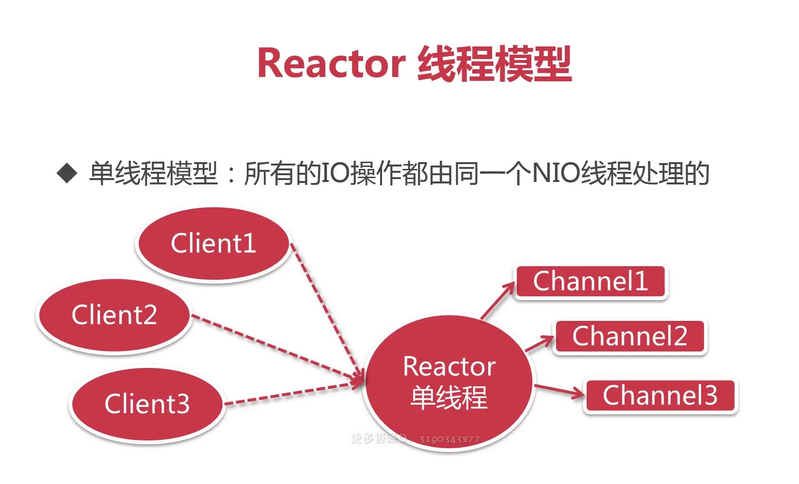
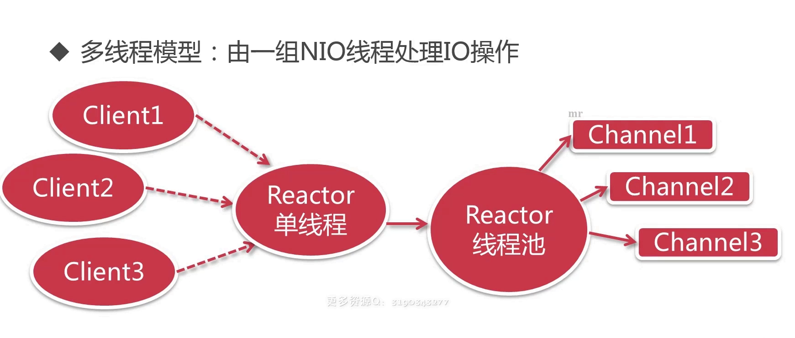
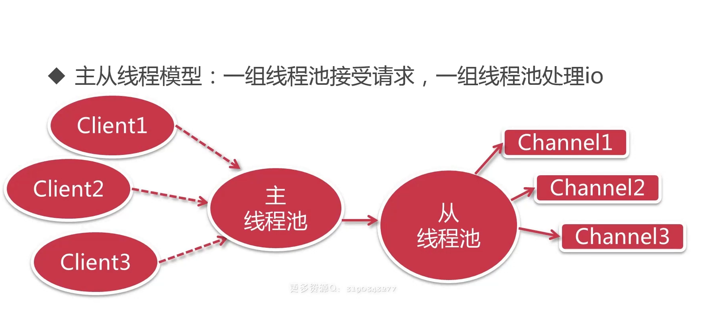

# Netty

## Hello Netty

### Reactor线程模型







构建Netty服务器的步骤

1 构建主从线程组 （NioEventLoopGroup）

2 定义服务器启动类 （ServerBootstrap）

3 为服务类设置channel （NioServerSocketChannel.class）

4 设置从线程组的助手类（Handler）初始化器 （）

5 监听启动和关闭服务器 （shutdownGracefully）

```java
public class HelloServer {

	public static void main(String[] args) throws Exception {

		// 1 构建主从线程组 
		// 主线程组
		EventLoopGroup bossGroup = new NioEventLoopGroup();
		// 从线程组
		EventLoopGroup workerGroup = new NioEventLoopGroup();

		try {
			// 2 定义服务器启动类
			ServerBootstrap serverBootstrap = new ServerBootstrap();
			// 设置主从线程组
			// 3 为服务类设置channel
			// 4 设置从线程组的助手类初始化器, 子处理器用于处理从线程组
			serverBootstrap.group(bossGroup, workerGroup)
					.channel(NioServerSocketChannel.class)	
					.childHandler(new HelloServerInitializer()); 
			ChannelFuture channelFuture = serverBootstrap.bind(8088).sync();
			// 监听关闭的channel，设置位同步方式
			channelFuture.channel().closeFuture().sync();
		} finally {
			// 5 监听启动和关闭服务器
			bossGroup.shutdownGracefully();
			workerGroup.shutdownGracefully();
		}
	}
}
```

```java
/**
 * 初始化器，channel注册后，会执行里面的相应的初始化方法
 */
public class HelloServerInitializer extends ChannelInitializer<SocketChannel> {

	@Override
	protected void initChannel(SocketChannel channel) throws Exception {
		// 通过SocketChannel去获得对应的管道
		ChannelPipeline pipeline = channel.pipeline();
		
		// 通过管道，添加handler
		// HttpServerCodec是由netty自己提供的助手类，可以理解为拦截器
		// 当请求到服务端，我们需要做解码，响应到客户端做编码
		pipeline.addLast("HttpServerCodec", new HttpServerCodec());
		
		// 添加自定义的助手类，返回 "hello netty~"
		pipeline.addLast("customHandler", new CustomHandler());
	}

}
```

```java
public class CustomHandler extends SimpleChannelInboundHandler<HttpObject> {

	@Override
	protected void channelRead0(ChannelHandlerContext ctx, HttpObject msg) 
			throws Exception {
		// 获取channel
		Channel channel = ctx.channel();
		
		if (msg instanceof HttpRequest) {
			// 显示客户端的远程地址
			System.out.println(channel.remoteAddress());
			
			// 定义发送的数据消息
			ByteBuf content = Unpooled.copiedBuffer("Hello netty~", CharsetUtil.UTF_8);
			
			// 构建一个http response
			FullHttpResponse response = 
					new DefaultFullHttpResponse(HttpVersion.HTTP_1_1, 
							HttpResponseStatus.OK, 
							content);
			// 为响应增加数据类型和长度
			response.headers().set(HttpHeaderNames.CONTENT_TYPE, "text/plain");
			response.headers().set(HttpHeaderNames.CONTENT_LENGTH, content.readableBytes());
			
			// 把响应刷到客户端
			ctx.writeAndFlush(response);
		}	
	}
}
```

这样就构建了一个简单的netty server,访问下面网址会得到Hello netty~

http://localhost:8088/

```
Hello netty~
```


### SimpleChannelInboundHandler的生命周期

```java
handlerAdded(ChannelHandlerContext ctx);

channelRegistered(ChannelHandlerContext ctx);

channelActive(ChannelHandlerContext ctx);

channelReadComplete(ChannelHandlerContext ctx);

channelInactive(ChannelHandlerContext ctx);

channelUnregistered(ChannelHandlerContext ctx);

handlerRemoved(ChannelHandlerContext ctx);
```


## Simple Netty

### 实时通信

Ajax论询

Long pull

websocket

使用netty实现简单的websocket

```java
public class WSServer {

	public static void main(String[] args) throws Exception {
		
		EventLoopGroup mainGroup = new NioEventLoopGroup();
		EventLoopGroup subGroup = new NioEventLoopGroup();
		
		try {
			ServerBootstrap server = new ServerBootstrap();
			server.group(mainGroup, subGroup)
				.channel(NioServerSocketChannel.class)
				.childHandler(new WSServerInitialzer());
			
			ChannelFuture future = server.bind(8088).sync();
			
			future.channel().closeFuture().sync();
		} finally {
			mainGroup.shutdownGracefully();
			subGroup.shutdownGracefully();
		}
	}
}
```

```java
public class WSServerInitialzer extends ChannelInitializer<SocketChannel> {

	@Override
	protected void initChannel(SocketChannel ch) throws Exception {
		ChannelPipeline pipeline = ch.pipeline();
		
		// websocket 基于http协议，所以要有http编解码器
		pipeline.addLast(new HttpServerCodec());
		// 对写大数据流的支持 
		pipeline.addLast(new ChunkedWriteHandler());
		// 对httpMessage进行聚合，聚合成FullHttpRequest或FullHttpResponse
		pipeline.addLast(new HttpObjectAggregator(1024*64));
        //websocket 服务器处理的协议，用于指定给客户端连接访问的路由 : /ws
		pipeline.addLast(new WebSocketServerProtocolHandler("/ws"));
		// 自定义的handler
		pipeline.addLast(new ChatHandler());
	}

}
```

```java
public class ChatHandler extends SimpleChannelInboundHandler<TextWebSocketFrame> {

	// 用于记录和管理所有客户端的channle
	private static ChannelGroup clients = 
			new DefaultChannelGroup(GlobalEventExecutor.INSTANCE);
	
	@Override
	protected void channelRead0(ChannelHandlerContext ctx, TextWebSocketFrame msg) 
			throws Exception {
		// 获取客户端传输过来的消息
		String content = msg.text();
		System.out.println("接受到的数据：" + content);
		// 下面这个方法，和上面的for循环，一致
		clients.writeAndFlush(
				new TextWebSocketFrame(
						"[服务器在]" + LocalDateTime.now() 
						+ "接受到消息, 消息为：" + content));
	}

	/**
	 * 当客户端连接服务端之后（打开连接）
	 * 获取客户端的channle，并且放到ChannelGroup中去进行管理
	 */
	@Override
	public void handlerAdded(ChannelHandlerContext ctx) throws Exception {
		clients.add(ctx.channel());
	}

	@Override
	public void handlerRemoved(ChannelHandlerContext ctx) throws Exception {
	}	
}
```

```html
<!DOCTYPE html>
<html>
	<head>
		<meta charset="utf-8" />
		<title></title>
	</head>
	<body>
		
		<div>发送消息:</div>
		<input type="text" id="msgContent"/>
		<input type="button" value="点我发送" onclick="CHAT.chat()"/>
		
		<div>接受消息：</div>
		<div id="receiveMsg" style="background-color: gainsboro;"></div>
		
		<script type="application/javascript">
			
			let CHAT = {
				socket: null,
				init: function() {
					if (window.WebSocket) {
						CHAT.socket = new WebSocket("ws://localhost:8088/ws");
						CHAT.socket.onopen = function() {
							console.log("连接建立成功...");
						},
						CHAT.socket.onclose = function() {
							console.log("连接关闭...");
						},
						CHAT.socket.onerror = function() {
							console.log("发生错误...");
						},
						CHAT.socket.onmessage = function(e) {
							console.log("接受到消息：" + e.data);
							var receiveMsg = document.getElementById("receiveMsg");
							var html = receiveMsg.innerHTML;
							receiveMsg.innerHTML = html + "<br/>" + e.data;
						}
					} else {
						alert("浏览器不支持websocket协议...");
					}
				},
				chat: function() {
					var msg = document.getElementById("msgContent");
					CHAT.socket.send(msg.value);
				}
			};
			
			CHAT.init();
			
		</script>
	</body>
</html>
```


