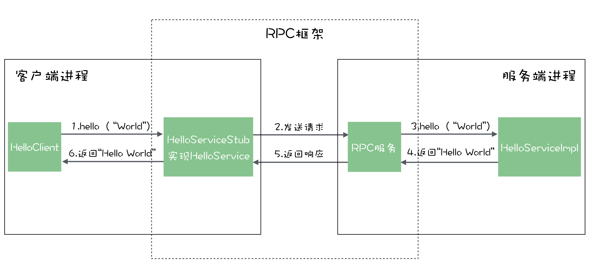

动态代理 && rpc stub 

#### RPC的使用 

客户端

```java
@Component
public class HelloClient {

    @Reference // dubbo注解
    private HelloService helloService;

    public String hello() {
      return helloService.hello("World");
    }
}
```

服务端

```java
@Service // dubbo注解
@Component
public class HelloServiceImpl implements HelloService {

    @Override
    public String hello(String name) {
        return "Hello " + name;
    }
}
```

在客户端，我们可以通过 @Reference 注解，获得一个实现了 HelloServicer 这个接口的对象，我们的业务代码只要调用这个对象的方法，就可以获得结果。


在服务端我们的实现类 HelloServiceImpl，实现了 HelloService 这个接口。然后，我们通过 @Service 这个注解，在 Dubbo 框架中注册了这个实现类 HelloServiceImpl。


通过某种技术，Dubbo 把服务端进程中的实现类 和 客户端进程中的类联系了起来。

#### RPC的原理

在客户端，业务代码得到的 HelloService 这个接口的实例，并不是我们在服务端提供的真正的实现类 HelloServiceImpl 的一个实例。它实际上是由 RPC 框架提供的一个代理类的实例。这个代理类有一个专属的名称，叫“桩（Stub）”。


客户端在调用 HelloService 的 hello 方法时，实际上调用的是桩的 hello 方法，在这个桩的 hello 方法里面，它会构造一个请求。这个请求就是一段数据结构，请求中包含两个重要的信息：请求的服务名，请求的所有参数。

然后，它会把这个请求发送给服务端，等待服务的响应。


RPC 框架在收到请求后，可以通过请求中的服务名找到 HelloService 真正的实现类 HelloServiceImpl。找到实现类之后，RPC 框架会调用这个实现类的 hello 方法，使用的参数值就是客户端发送过来的参数值。服务端的 RPC 框架在获得返回结果之后，再将结果封装成响应，返回给客户端。客户端 RPC 框架的桩收到服务端的响应之后，从响应中解析出返回值，返回给客户端的调用方。这样就完成了一次远程调用。

如下图所示




