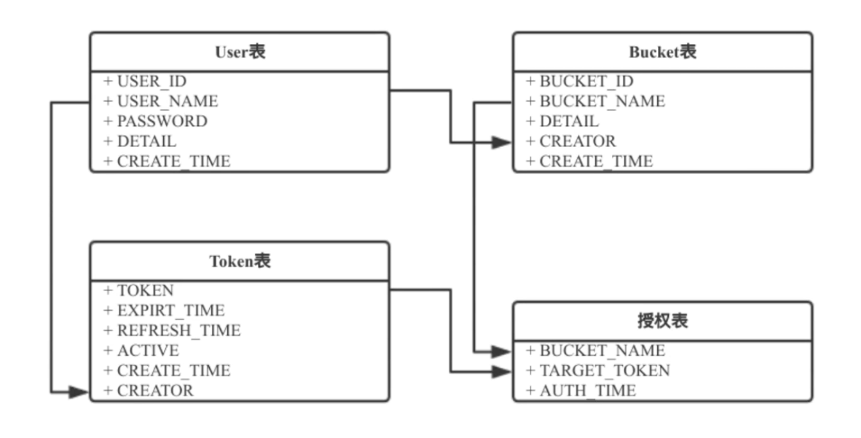

## HBase

https://archive.apache.org/dist/hbase/1.2.4/

下载 hbase-1.2.4-bin.tar.gz

```shell
vaderwang@vaderwang-X399:~/software$ tar zxf hbase-1.2.4-bin.tar.gz
```

hdfs-site.xml和core-site.xml移动到hbase的配置文件目录

配置 hbase-env.sh

```sh
export JAVA_HOME=/usr/local/jdk1.8.0_144/
```

```sh
# Configure PermSize. Only needed in JDK7. You can safely remove it for JDK8+
# export HBASE_MASTER_OPTS="$HBASE_MASTER_OPTS -XX:PermSize=128m -XX:MaxPermSize=128m"
# export HBASE_REGIONSERVER_OPTS="$HBASE_REGIONSERVER_OPTS -XX:PermSize=128m -XX:MaxPermSize=128m"
```

配置 hbase-site.xml

```xml
<configuration>
  <property>
    <name>hbase.rootdir</name>
    <value>hdfs://localhost:9000/hbase</value>
  </property> 
  <property>
    <name>hbase.zookeeper.property.dataDir</name>
    <value>/home/vaderwang/hadoop_data/zookeeper</value>
  </property> 
  <property>
    <name>hbase.cluster.distributed</name>
    <value>true</value>
  </property>
</configuration>
```

```shell
vaderwang@vaderwang-X399:~/software/hbase-1.2.4/bin$ ./start-hbase.sh 
```

```shell
vaderwang@vaderwang-X399:~/software/hbase-1.2.4/bin$ ./hbase shell
```

### ZooKeeper安装

https://archive.apache.org/dist/zookeeper/

下载对应的版本(3.4.9)

格式化Hadoop和HBase，先停止HBase和Hadoop

```shell
cd habse/bin 
./stop-hbase.sh

cd hadoop/sbin
./stop-dfs.sh
```

解压安装配置zookeeper

```bash
tar zxf zookkeeper-3.4.9.tar.gz

cd zookkeeper-3.4.9/conf

cp zoo_sample.cfg zoo.cfg

vim zoo.cfg
```

添加一行配置

```
server.1=localhost:2888:3888
```

创建zookeeper的文件目录

```shell
mkdir /tmp/zookeeper
```

在zookeeper的文件目录下添加文件，因为之前我们输入的是server.1所以在这个文件中，我们写入1

```shell
vim /tmp/zookeeper/myid
```

启动zookeeper

```shell
zookeeper/bin$ ./zkServer.sh start
```

清空Hadoop和HBase

```shell
cd hadoop/etc/hadoop 
vim hdfs-site.xml
```

清空dfs.namenode.name.dir和dfs.datanode.data.dir

```shell
rm -rf /home/xxxx
rm -rf /home/xxxx
hadoop/bin$ ./hadoop namenode -format
```

要是输出为Exiting with status 0就是格式化成功了，启动Hadoop

```shell
hadoop/sbin$ ./start-dfs.sh
```

接下来是HBase

```shell
hbase/conf$ vim hbase-env.sh

export HBASE_MANAGES_ZK=false

hbase/conf$ vim hbase-site.xml
```

```xml
<configuration>
  <property>
    <name>hbase.rootdir</name>
    <value>hdfs://localhost:9000/hbase</value>
  </property> 
  <property>
    <name>hbase.zookeeper.property.dataDir</name>
    <value>/home/vaderwang/hadoop_data/zookeeper</value>
  </property> 
  <property>
    <name>hbase.cluster.distributed</name>
    <value>true</value>
  </property>
  <property>
    <name>hbase.zookeeper.quorum</name>
    <value>localhost</value>
  </property>
  <property>
    <name>hbase.zookeeper.property.clientPort</name>
    <value>2181</value>
  </property>
  <property>
    <name>hbase.hregion.menstore.flush.size</name>
    <value>268435456</value>
  </property>
  <property>
    <name>hbase.hregion.max.filesize</name>
    <value>107374182400</value>
  </property>
  <property>
    <name>hbase.hregion.majorcompaction</name>
    <value>0</value>
  </property>
</configuration>
```

保存配置后启动HBase

```shell
hbase/bin$ ./start-hbase.sh

hbase/bin$ hbase shell
```

```shell
list
create 'test','cf'
```

### HOS开发逻辑

用户管理模块

创建用户时，添加一条永久token到Token表

删除用户时，删除用户的token及其token与bucket的权限映射

